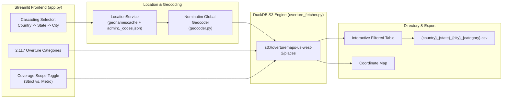

# Global Business Directory Extractor 🌍

A desktop-grade, zero-cost web application built with **Streamlit** and **DuckDB** that streams and extracts verified business contact information (Business Name, Industry Category, Telephone, Website, Native Email, Street Address, Locality, Postal Code, State/Region, Country, and Coordinates) for any city worldwide.

This tool runs **100% free**, querying the open **Overture Maps** dataset directly on Amazon S3 via DuckDB without external paid APIs and without HTTP web scraping.

---

## 🏗️ System Architecture



### Key Modules

1. **`app.py`**: Streamlit dashboard featuring cascading Country → State → City selectors, searchable taxonomy of 2,117 categories, coverage scope toggle, KPI metric cards, filterable directory table, geographic coordinate map, and CSV export.
2. **`location_service.py`**: In-memory administrative hierarchy engine utilizing `geonamescache` and `admin1_codes.json` for zero-latency reactive location cascading across 250+ countries and 34,000+ cities.
3. **`geocoder.py`**: Global geocoder wrapping `geopy.geocoders.Nominatim` that resolves global location strings into exact spatial bounding boxes `(xmin, ymin, xmax, ymax)`, with optional buffer expansion (+20% for metropolitan coverage).
4. **`overture_fetcher.py`**: High-performance streaming DuckDB engine that reads Parquet partitions directly from AWS S3, filters spatially and by category, and extracts the complete rich schema without dropping records lacking websites.
5. **`admin1_codes.json`**: Bundled mapping of 3,865 worldwide subdivision codes to human-readable region/state names.
6. **`overture_categories.json`**: Bundled official taxonomy containing all 2,117 standardized Overture Maps business categories.

---

## 🚀 Quick Start

### 1. Prerequisites
- Python 3.10+

### 2. Setup Virtual Environment
```bash
# Windows
python -m venv .venv
.venv\Scripts\activate

# Linux / macOS
python3 -m venv .venv
source .venv/bin/activate
```

### 3. Install Dependencies
```bash
pip install -r requirements.txt
```

### 4. Run the Streamlit Application
```bash
streamlit run app.py
```

Open your browser at `http://localhost:8501`.

---

## 💡 Features

- 🌐 **Global Reach**: Query businesses across 250+ countries and territories.
- 🏢 **2,117 Industry Categories**: Full standardized Overture Maps taxonomy searchable from a single dropdown.
- ⚡ **Instant Direct Streaming**: DuckDB streams Parquet files directly from AWS S3 in seconds; no slow HTTP scraping.
- 📋 **Rich Schema Extraction**:
  - `name`: Primary business name
  - `category`: Primary industry category
  - `phone`: Telephone number
  - `website`: Official website
  - `email`: Native business email
  - `street_address`: Freeform street address
  - `locality`: City / locality name
  - `postcode`: Postal code / ZIP code
  - `region`: State / province / administrative region
  - `country`: 2-letter ISO country code
  - `latitude` / `longitude`: Exact geographic coordinates
- 🗺️ **Coordinate Map**: Visualizes businesses on an interactive geographic map.
- 📥 **Standardized CSV Export**: Generates clean CSV files titled `{country}_{state}_{city}_{category}.csv`.
